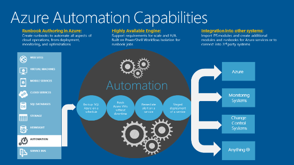
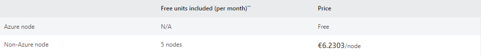
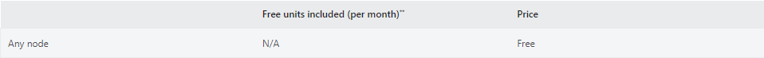

# Automation 

[Link de Acesso](https://learn.microsoft.com/en-us/azure/automation/overview)

## Objetivo do produto 

Azure Automation é uma plataforma de automatização baseada em nuvens com uma boa relação custo-benefício. Fornece um serviço de automatização expansivo que lhe permite automatizar tarefas que de outra forma ocupariam o valioso tempo de um pessoal de IT.
Baseada e construída utilizando o PowerShell Workflow, é compatível com múltiplos fornecedores, plataformas de nuvens, e sistemas locais. Azure Automation também pode ser configurada para interagir e automatizar a infra-estrutura On-Premise. O componente que permite esta funcionalidade é chamado de Azure Hybrid Runbook Worker.

## Benefícios

* Reduz os custos: As suas tarefas rotineiras e demoradas de gestão de nuvens são frequentemente propensas a erros. Automação Azure ajuda a reduzir erros e a aumentar a eficiência juntamente com o Windows Azure para o ajudar a reduzir custos operacionais e poupar tempo.

* Optimiza os fluxos de trabalho: A automação do Azure permite-lhe aproveitar os fluxos de trabalho existentes ou personalizá-los para desenhar os seus próprios fluxos de trabalho. Pode monitorizar e manter os recursos do Azure e também criar e implementar os seus próprios runbooks, conforme necessário.

* Integração: A Azure Automation funciona perfeitamente com websites, VMs, servidores, armazenamento, e outros serviços Azure. Pode também ser utilizado com quaisquer aplicações de terceiros, ofertas de serviços, ou APIs públicas da Internet.

* Serviço de confiança: O Azure lida eficientemente com sistemas, ferramentas e departamentos que melhoram o seu desempenho e poupam tempo.

## 'Special Feature' Azure Automation

* Integra-se com outros sistemas ou sistemas existentes através da construção de módulos de integração PowerShell.
* Acelera o processo de fluxo de trabalho flexível.
* Melhora a fiabilidade no serviço entre diferentes ferramentas, sistemas, e departamentos.
* Reduz as actividades manuais na detecção de erros e correcções.
* Os runbooks são a característica especial do Azure Automation. Ajuda na automatização das tarefas que consomem tempo, requerem tempo para correr e executar, e tem possibilidades de obter erros frequentes.

## Categorias de operação Automation

* Implementação e gestão de recursos - criar e configurar programmaticamente usando automação ou infra-estrutura como ferramentas de código para fornecer implementação e gestão consistente e repetível dos recursos da nuvem.

* Resposta a eventos externos - com base num evento externo crítico, como a resposta a alterações da base de dados, actuando de acordo com as entradas dadas a uma página web, etc., é possível diagnosticar e resolver problemas.

* Orquestração complexa - ao integrar com produtos de primeira ou terceira parte, pode definir um fluxo de trabalho de automatização de ponta a ponta.

## Automação em termos de empresa

 Azure Automation Tools virtualizam a infra-estrutura da Empresa. Permitem-lhes racionalizar as suas cargas de trabalho relacionadas com as TI, reduzir a atenção manual, automatizar os backups, e os sistemas de recuperação.

## Preços

**Automação de Processos** - A automatização de processos inclui trabalhos de runbook e de watchers.

**Gestão de Configurações** - A gestão de configurações inclui o serviço pull de configuração e as capacidades de registo de alterações. A faturação baseia-se no número de nós registados no serviço e os dados de registo armazenados no serviço [Azure Log Analytics](../AzureMonitor/AzureMonitor.md).

**Gestão de Atualizações** - A gestão de atualizações inclui visibilidade e implementação das atualizações no ambiente.

