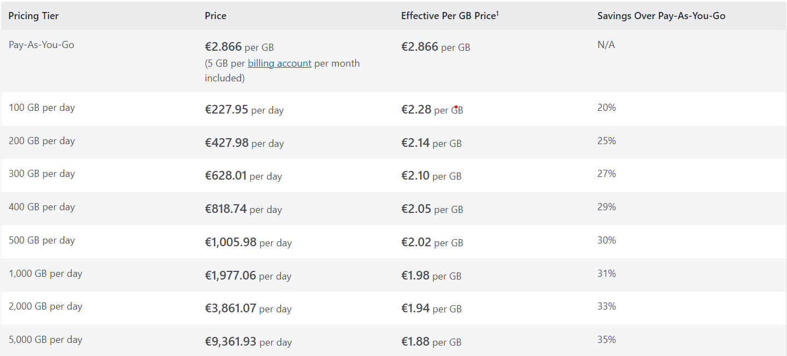
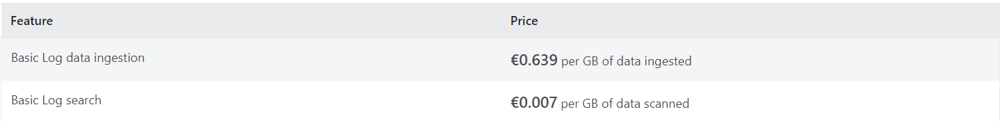
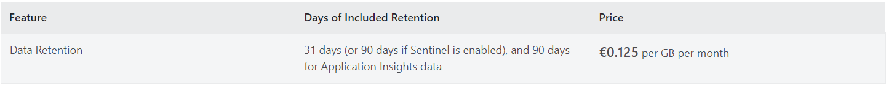
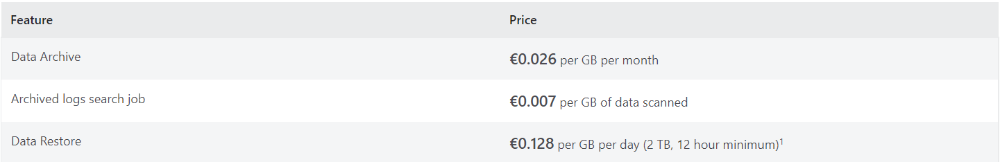
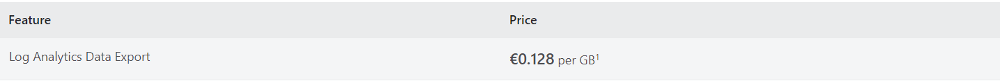
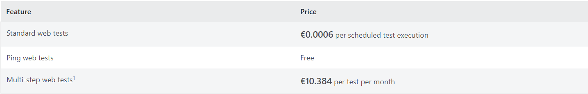
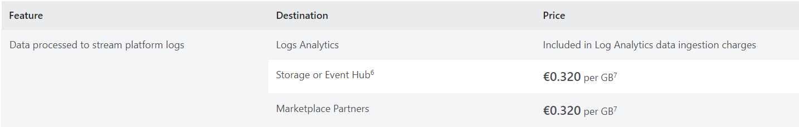
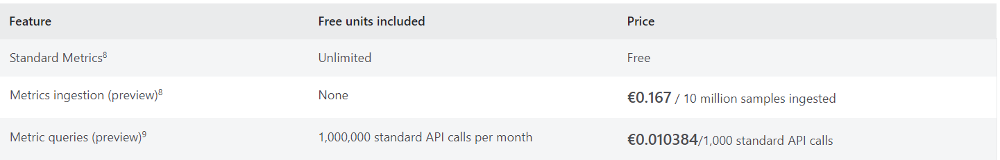
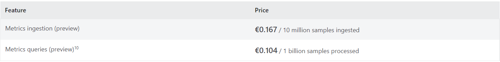
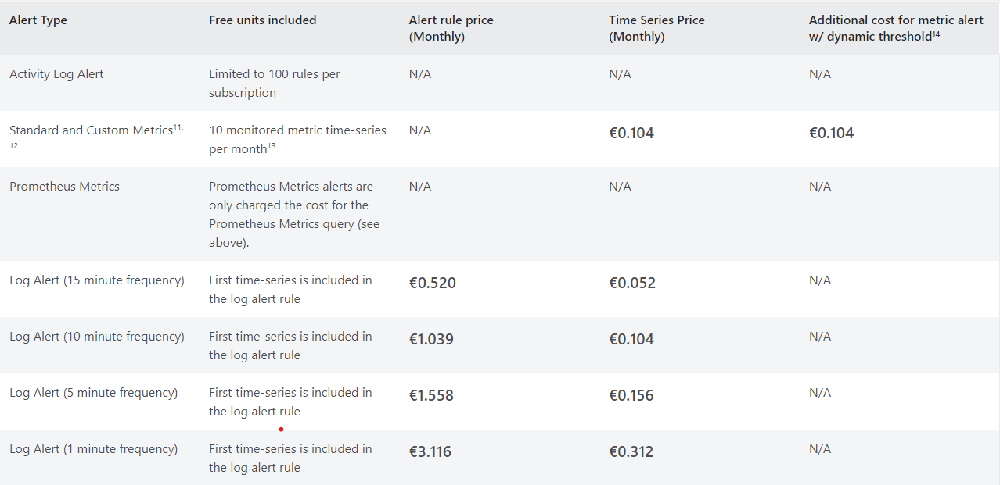

# Azure Monitor

[Link de Acesso](https://azure.microsoft.com/en-us/products/monitor/#overview)

## Objetivo do Produto

* "Curated insights" ara uma experiência de monitorização personalizada sobre um determinado serviço ou conjunto de serviços com configuração mínima
* Ferramentas de visualização
* Poderosa plataforma de dados para a resolução de problemas mais profundos, diagnóstico e análise
* Resposta a situações críticas com alertas quase em tempo real e capacidade de auto-escalar recursos quando a carga aumenta

## Beneficios do Azure Monitor

* Monitorização sem falhas
* Melhor visibilidade das infra-estruturas
* Notificações Instantâneas
* Resolução Automática
* Eficiência de Custos
* Permite facilmente o Azure Monitor para qualquer recurso Azure ou híbrido
* Observar a qualquer nível em toda a stack para uma visão profunda
* Inovar com uma plataforma aberta e expansível
* Segurança e conformidade abrangentes, incorporadas

## Preços

**Analytics Logs** :

**Basic Logs** :

**Log Data Retention** :

**Log Data Archive and Restore**:

**Log Data Export**:

**Web Tests**:

**Platform Logs**:

**Standard and Custom Metrics**:

**Prometheus Metrics**:

**Alert rules**:

**Notifications**:
