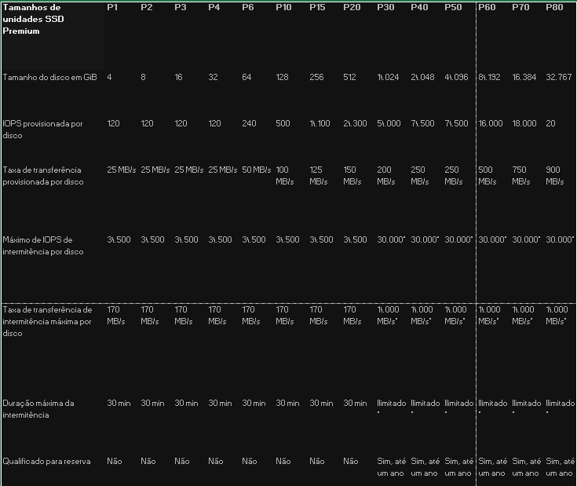

# Disks

[Link de Acesso](https://learn.microsoft.com/en-us/azure/virtual-machines/disks-types)

## Objetivo do Produto

Os discos geridos pelo Azure são volumes de armazenamento a nível de bloco geridos pelo Azure e utilizados com as Máquinas Virtuais Azure. Os discos geridos são como um disco físico num servidor no local, mas, virtualizados. Com os discos geridos, tudo o que tem de fazer é especificar o tamanho do disco, o tipo de disco, e fornecer o disco. Uma vez providenciado o disco, o Azure trata do resto.

Os tipos de discos disponíveis são discos ultra, unidades de estado sólido (SSD) premium, SSDs standard, e unidades de disco rígido standard (HDD).

## Benefícios

* Altamente durável e disponível
* Implantação de VM simples e escalável
* Integração com conjuntos de disponibilidade
* Integração com Zonas de Disponibilidade
* Apoio Azure Backup
* Cópia de Segurança de Discos do Azure
* Controlo de acesso granular

## Tipos

* Azure Ultra Disks
* Premium SSD
* Premium SSD v2
* Standard SSD
* Standard HDD

### Azure Ultra Disks

Os discos Azure Ultra são a opção de armazenamento com maior desempenho para máquinas virtuais Azure (VMs). Pode alterar os parâmetros de desempenho de um disco ultra sem ter de reiniciar os seus VMs. Os discos ultra são adequados para cargas de trabalho intensivas de dados, tais como SAP HANA, bases de dados de topo e cargas de trabalho pesadas de transações.

Os discos ultra devem ser utilizados como discos de dados e só podem ser criados como discos vazios. Deve utilizar unidades de estado sólido Premium (SSDs) como discos do sistema operativo (OS).

#### Tamanho Ultra

Os discos Azure ultra oferecem até 32-TiB por região por padrão, mas discos ultra suportam maior capacidade por pedido. Os discos ultra são concebidos para fornecer latências submilissegundos e IOPS alvo e produção descrita abaixo

#### Limitações Ultra

* Os discos ultra não podem ser usados como discos de SO, só podem ser criados como discos de dados vazios.
* Os discos ultra também não podem ser usados com algumas funcionalidades e funcionalidades, incluindo exportação de discos, instantâneos de disco, alteração do tipo de disco, imagens VM, conjuntos de disponibilidade ou encriptação do disco Azure.
* Azure Backup e Azure Site Recovery não suportam discos ultra. Além disso, apenas são suportadas leituras não em cache e escritas não em cache.
* Embora a maioria das aplicações sejam compatíveis com tamanhos do sector 4k, algumas requerem 512 tamanhos do setor byte. A Oracle Database, por exemplo, requer a libertação 12.2 ou posterior para suportar discos nativos 4k. Para versões mais antigas do Oracle DB, é necessário o tamanho do sector byte 512.
* As únicas opções de redundância de infraestrutura atualmente disponíveis para discos ultra são zonas de disponibilidade. Os VMs que utilizam quaisquer outras opções de redundância não podem anexar um disco ultra. Como mostra a figura abaixo :

#### Máquinas Virtuais compatíveis com Discos Ultra

### Premium SSD

Os SSDs Azure Premium oferecem suporte de disco de alto desempenho e baixa latência para máquinas virtuais (VMs) com cargas de trabalho intensivas de entrada/saída (IO). Para aproveitar a velocidade e desempenho dos SSDs Premium, pode migrar discos VM existentes para SSDs Premium. Os SSDs premium são adequados para aplicações de produção críticas de missão, mas só pode usá-los com séries VM compatíveis.

#### Tamanho Premium

A capacidade, o IOPS e a produção são garantidos quando um disco de armazenamento premium é a provisionado. Por exemplo, se criar um disco P50, o Azure prevê capacidade de armazenamento de 4.095 GB, 7.500 IOPS e 250-MB/s para esse disco. A sua aplicação pode utilizar a maior ou parte da capacidade e desempenho. Os SSDs premium são concebidos para fornecer as latências milissegundos de um dígito, o IOPS-alvo e a produção descrita na tabela anterior 99,9% das vezes.

#### Limitações Premium

### Premium SSD v2

O Azure Premium SSD v2 é projetado para cargas de trabalho de empresas intensas em IO que requerem latências consistentes de discos sub-milisegundos e alta iops e produção a baixo custo. O desempenho (capacidade, produção e IOPS) dos discos Premium SSD v2 pode ser configurado de forma independente a qualquer momento, tornando mais fácil para mais cenários serem rentáveis ao satisfazer as necessidades de desempenho. Por exemplo, uma carga de trabalho de base de dados intensiva de transações pode necessitar de uma grande quantidade de IOPS em tamanho reduzido, ou uma aplicação de jogo pode precisar de uma grande quantidade de IOPS durante as horas de ponta.

#### Tamanho Premium V2

#### Limitações Premium v2 

* Os discos premium SSD v2 não podem ser usados como disco DE.
* Discos Premium SSD v2 só podem ser ligados a VMs zonais.
* Tirar fotografias não é suportado, e não é possível criar um Premium SSD v2 a partir da imagem de outro tipo de disco.
* Discos Premium SSD v2 não podem ser ligados a VMs com encriptação no anfitrião ativada.
* A encriptação do disco Azure não é suportada para VMs com discos Premium SSD v2.
* Discos Premium SSD v2 não podem ser ligados a VMs em Conjuntos de Disponibilidade.
* Azure Backup e Azure Site Recovery não são suportados para VMs com discos Premium SSD v2.

#### Premium v2 vs Premium 

Ao contrário dos SSDs Premium, o Premium SSD v2 não tem tamanhos dedicados. Pode definir um Premium SSD v2 para qualquer tamanho suportado que preferir e fazer ajustes granulares ao desempenho sem tempo de inatividade. Premium SSD v2 não suporta o caching do anfitrião, mas beneficia significativamente de uma latência mais baixa que aborda alguns dos mesmos problemas fundamentais que os endereços de caching do hospedeiro. A capacidade de ajustar IOPS, produção e tamanho a qualquer momento também significa que pode evitar a sobrecarga de manutenção de ter de riscar discos para satisfazer as suas necessidades.

### HDD Standard

Os HDDs standard Azure oferecem suporte fiável e de baixo custo para VMs que executam cargas de trabalho tolerantes à latência. Com o armazenamento padrão, os seus dados são armazenados em HDDs, e o desempenho pode variar mais do que o dos discos baseados em SSD. Os HDDs standard são projetados para fornecer latências de escrita de menos de 10 ms e ler latências de menos de 20 ms para a maioria das operações de IO. No entanto, o desempenho real pode variar dependendo do tamanho do IO e do padrão de carga de trabalho. Ao trabalhar com VMs, pode utilizar discos HDD padrão para cenários dev/teste e cargas de trabalho menos críticas. Os HDDs standard estão disponíveis em todas as regiões do Azure e podem ser usados com todos os VMs Azure.

#### Tamanho HDD Standard

