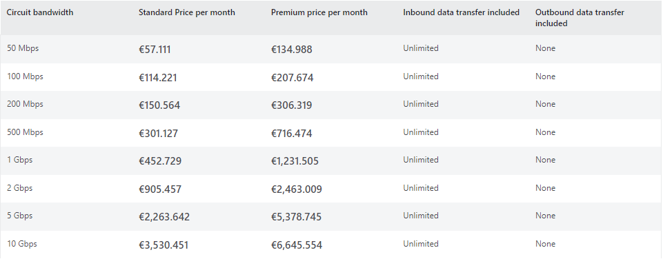
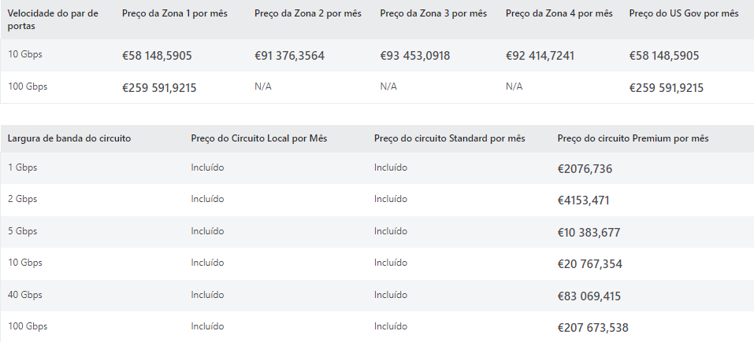
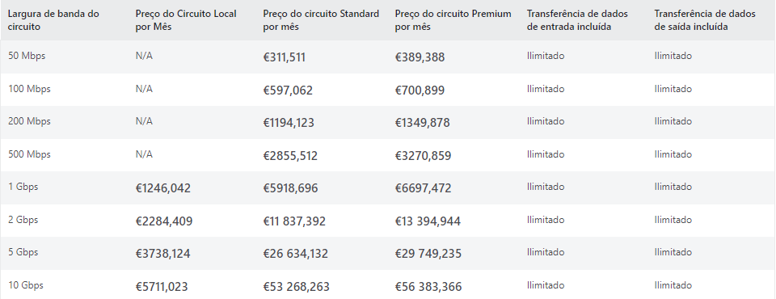
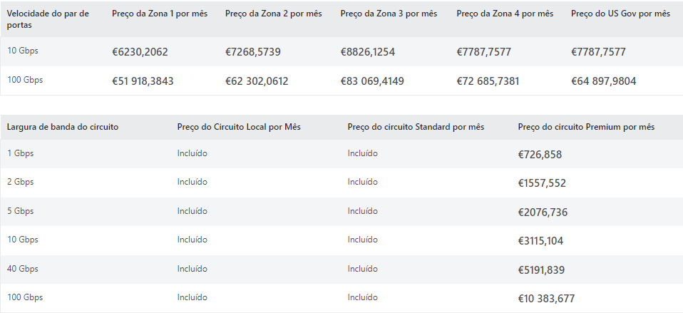
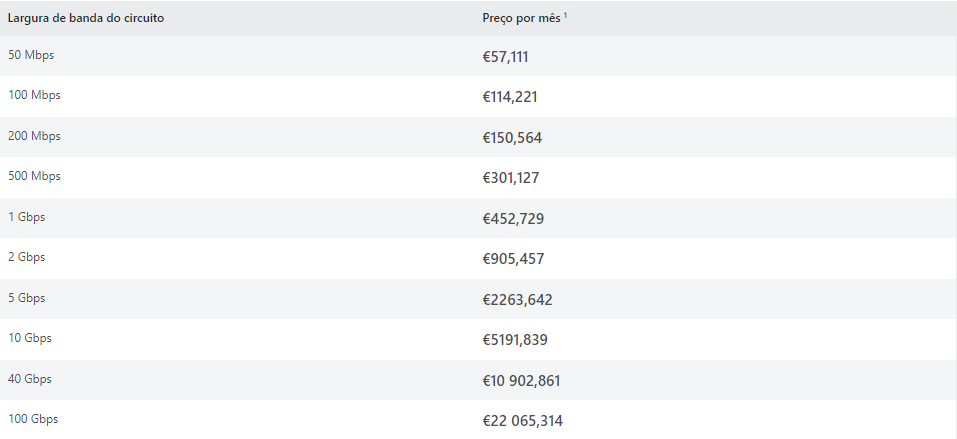
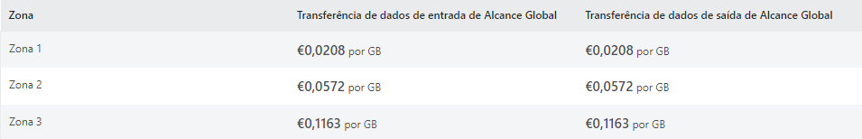

# Express Route 

[Link de Acesso](https://azure.microsoft.com/en-us/products/expressroute/#overview)

## Objetivo do Produto

* Ligações de cloud privada ao Azure
* Latência consistente
* Ligação direta à sua WAN
* Suporte para cargas de trabalho IPv6
* Maior fiabilidade e velocidade
* Suporte para largura de banda até 100 Gbps
* Crie ligações entre redes no local, através da rede global da Microsoft
* Encriptação de ligação física com MACsec

## Benefícios 

* A conectividade da Camada 3 entre a sua rede no local e o Microsoft Cloud através de um fornecedor de conectividade.
* Conectividade de serviços em nuvem da Microsoft em todas as regiões na região geopolítica.
* Conectividade global com os serviços da Microsoft em todas as regiões com o suplemento ExpressRoute Premium.
* Encaminhamento dinâmico entre a rede e a Microsoft através do BGP.
* Redundância incorporada em cada localização de peering para maior fiabilidade.
* Ligação tempo SLA (Service-Level Agreement).

## Funcionalidades

* Utilizar uma cloud privada virtual para armazenamento, cópia de segurança e recuperação
* Expandir e ligar os seus datacenters
* Criar aplicações híbridas

## Tipos de ExpressRoute

* Azure ExpressRoute - Expanda as suas redes no local para a cloud da Microsoft através de uma ligação privada, com a ajuda de um fornecedor de conectividade.
* Azure ExpressRoute Direct - Ligue-se diretamente à rede global da Microsoft. A capacidade dupla dedicada está disponível em 10 Gbps e 100 Gbps
* Alcance Global do Azure ExpressRoute - Ligue circuitos entre si para criar uma ligação privada entre as suas redes no local.

## Preços

### Circuitos ExpressRoute

**Planos de Dados Limitados** - Todas as transferências de dados de entrada são gratuitas e todas as transferências de dados de saída são cobradas com base numa taxa pré-determinada. Também é cobrada uma taxa mensal da porta aos utilizadores (baseada nas portas duplas de Elevada Disponibilidade).

**Preços da taxa de transferência de dados de saída**

**Plano de Dados Ilimitado** - O Plano de Dados Ilimitado contém uma única tarifa fixa mensal de porta que inclui todos os custos de transferência de dados de entrada e de saída.
A tarifa dos Circuitos Locais e Standard está incluída na tarifa de porta, enquanto para os circuitos do ExpressRoute Premium é aplicável uma tarifa de circuito premium.

**Circuito Local do Express Route** - Um circuito Local do ExpressRoute numa localização de peering específica dá-lhe acesso apenas a uma ou duas regiões do Azure no ou perto do mesmo metro. Especificamente, só pode anunciar rotas (por parte da Microsoft e peering privado) a partir da região local correspondente do circuito do ExpressRoute e não poderá receber rotas para outras regiões diferentes da região Local definida.

**Circuito Padrão do Express Route** - Um circuito ExpressRoute Standard dá-lhe acesso a todas as regiões do Azure na mesma área geopolítica sem custos adicionais sobre os custos do plano existente.

**Circuito Premium do ExpressRoute** - Um circuito Do ExpressRoute Premium dá-lhe acesso a todas as regiões do Azure globalmente.

**ExpressRoute Direct** - Com o ExpressRoute Direct, os clientes ligam-se diretamente à rede da Microsoft através de um par de portas de 10 ou 100 Gbps para criar circuitos do ExpressRoute Local, Standard e do ExpressRoute Premium.
O ExpressRoute Direct contém uma taxa de Porta mensal e, para circuitos do ExpressRoute Premium, uma taxa de Circuito Premium. A transferência de dados de saída aplica-se aos circuitos Standard e Premium, mas não aos circuitos Local. O suplemento de Alcance Global do ExpressRoute e os encargos de entrada e saída aplicam-se aos circuitos de Alcance Global.

**Suplemento do Alcance Global** - Com o Alcance Global do ExpressRoute, pode interligar os circuitos do ExpressRoute para estabelecer uma rede privada entre a sua rede no local.

**Taxa de transferência de Alcance Global**
