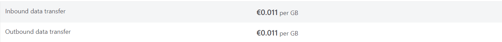
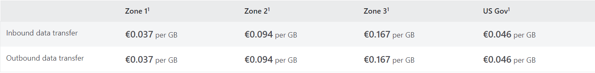
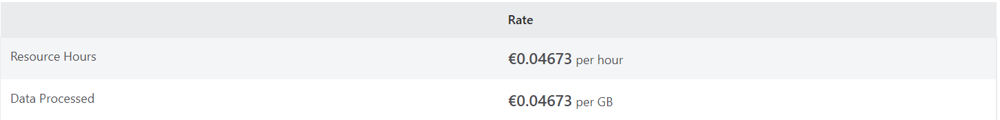

# Virtual Nets

[Link de Acesso](https://azure.microsoft.com/en-us/products/virtual-network/#overview)

## Objetivo do Produto

* Crie e gira uma infraestrutura de rede segura na cloud.
* Proteja as suas ligações com uma VPN IPSec ou o Azure ExpressRoute.
* Crie topologias de rede sofisticadas com aplicações virtuais.
* Traga os seus próprios endereços IP e servidores DNS.
* Obtenha controlo granular do tráfego entre sub-redes.
* Obtenha um ambiente isolado e altamente seguro para as suas aplicações.

## Benefícios

* Proporciona um ambiente isolado para as aplicações.
* Uma sub-rede numa VNet pode aceder à Internet pública por default.
* Facilidade de dirigir o tráfego a partir de recursos.
* É uma rede altamente segura.
* Tem uma alta conectividade de rede.
* Constrói topologias de rede sofisticadas de uma forma simples.

## Funcionalidades

* Segurança e isolamento otimizados
* Alcance global do Azure
* Topologias de rede sofisticadas
* Expanda o seu datacenter para a cloud
* Flexibilidade para criar aplicações
* Gerir redes virtuais em escala

## Preços

**VNET Peering dentro da região**:

**Global VNET**:

**NAT Gateway**:
