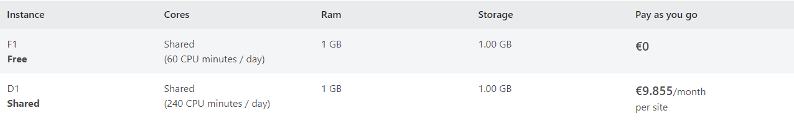
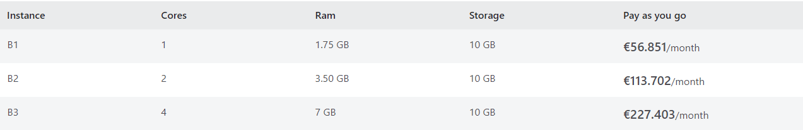
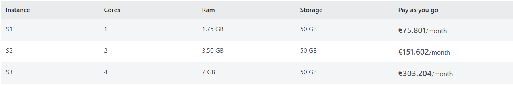
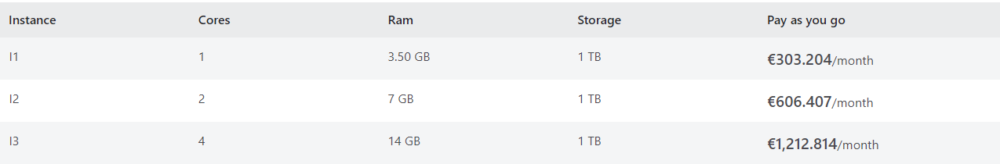
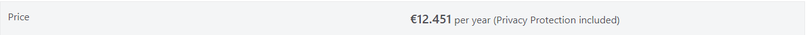

# WebApps Azure

[Link de Acesso](https://azure.microsoft.com/en-us/products/app-service/web/)

## Objetivo do Produto

* Saltar a construção da aplicação
* Aumentar a produtividade do desenvolvedor
* Automatizar as implementações com integração contínua/implantação contínua (CI/CD)
* Obtenha alta disponibilidade dentro e através das regiões Azure, à medida que envia dados e serviços de alojamento através de múltiplos locais com um clique do rato.
* Obter insights e análises accionáveis
* Tirar partido da consistência híbrida
* Escolher serviços a nível empresarial

## Benefícios WebApps via Azure

* Desenvolvimento de aplicações web de alta segurança
* Framework versátil e multilíngua
* Melhoria da produtividade do desenvolvedor com Modelos de Aplicação
* Integração com Visual Studio
* Integração Segura com outras aplicações SaaS (Software as a Service)

## Documentação 

Acesso a Documentação da WebApps:

* [Link de Acesso](https://learn.microsoft.com/pt-pt/azure/app-service/overview)

## Preços

**Tipos de preço**:
* Gratuito
* Shared
* Básico
* Base
* Premium
* Isolado

**Acesso a tabela de preços** : 

* [Link de Acesso](https://azure.microsoft.com/en-us/pricing/details/app-service/windows/#pricing)

**Tabela base** : 
 

**Serviço Livre e Partilhado** : 

**Serviço Básico** :

**Serviço Standard** : 

**Serviço Premium v2** :

**Serviço Premium v3** : 

**Serviço Isolado** :

**Serviço Isolado v2** : 

**App Service Domain** : 

**Certificados App Services** : 

**Conexões SSL** : 

